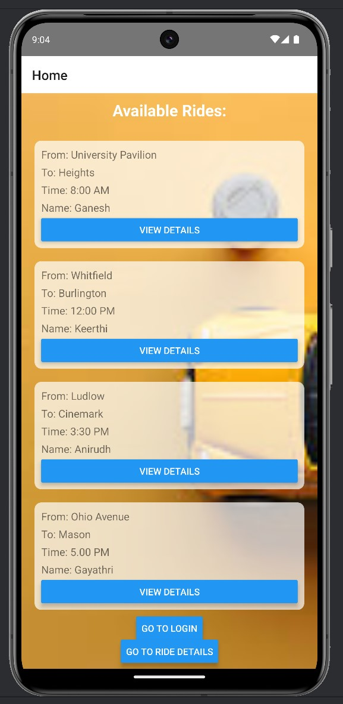
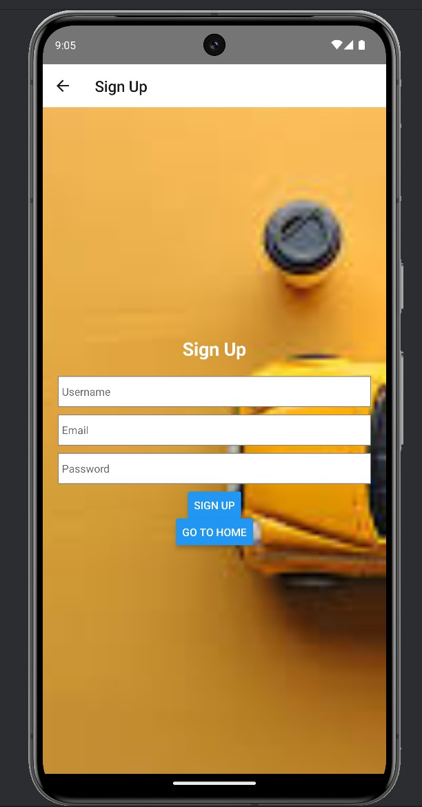
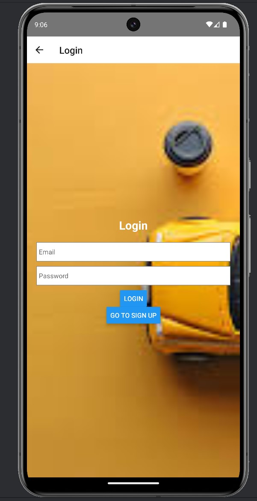
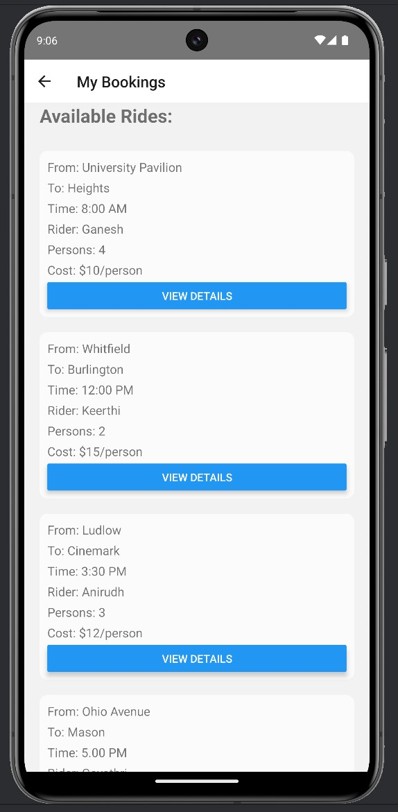
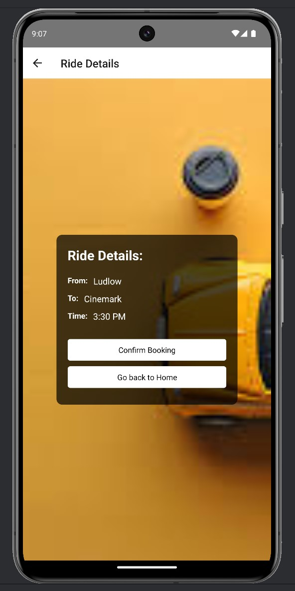
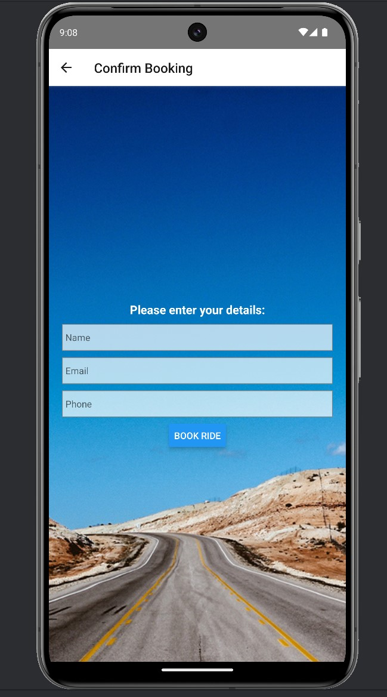

# Ride Booking

- In today’s world transportation is an important aspect of people moving from one place to other. Third
party apps like Uber, Lyft are the major modes of car booking transportation used by people. The main
problem arises here, people cannot able to choose type of driver they need. That might depend on
race, ethnicity, rating and their experience. Also, the price will be determined by the app itself. People
has no flexibility to book the ride in their interval of price. This problem will be addressed by the RIDES
BOOKING APP, where people can choose robust drivers from the available list of drivers based on
multiple categories. They can chat with the driver instantly and they can able to bargain the price.
Based on their need, people can book their ride for the current time or they can prebook the ride.

## PROBLEM DOMAIN:

- The problem domain arises involves addressing multiple problems like choosing the correct
technology. However, this project will be developed using React Native. Other challenges like verifying
rider’s details like name, email, contact number and details related to routes they particularly
interested in. Also, the user experience is an important aspect to be considered. The ride booking
becomes more complicate when ride requests with multiple preferences and taking consideration of
driver preferences too. This algorithmic problem is crucial for the platform to function as efficiently as
feasible overall and to improve user satisfaction.

## PROJECT OBJECTIVE:

- The project objective is to develop a ride booking app with good user interface and facilitating the
flexibility to choose drivers for passengers and passengers for the drivers. Other important objective
is to develop a chat application with driver to discuss about the ride details and price details. People
has the option to fix the price by talking to the driver. Integrating these features gives continuous
improvement to the modern transportation needs proving a seamless experience to the users.

## EXPECTED RESULT:

- This project aims to provide users the ability to choose the drivers from the list of available drivers
based on multiple factors. The overall expected outcome is not only providing the user-interface but
designing with well-rounded booking of rides that will meet the people requirement of booking the
ride earlier or at the same time

## App Description

- The App.tsx file sets up navigation using the react-navigation library. It defines a stack navigator with different screens such as Home, Login, SignUp, RideDetails, ConfirmBooking, and MyBookings. Each screen is associated with a component responsible for rendering its content.
- The project includes several screen components such as HomeScreen, LoginScreen, SignUpScreen, RideDetailsScreen, ConfirmBookingScreen, and MyBookings. These components define the UI and functionality for various parts of the application, including displaying available rides, user authentication, booking confirmation, and viewing user bookings.
-  Data Handling and Styling: The screens utilize dummy data for demonstration purposes. The components use React Native's ScrollView, View, Text, Button, and ImageBackground components to structure and style the user interface. Additionally, styles are defined using the StyleSheet.create method to ensure consistent and visually appealing UI across different screens.

## Screenshots

1. Homescreen

2. Signup

3. Login

4. RideDetails

5. RideConfirmation

6. BookingConfirmation

